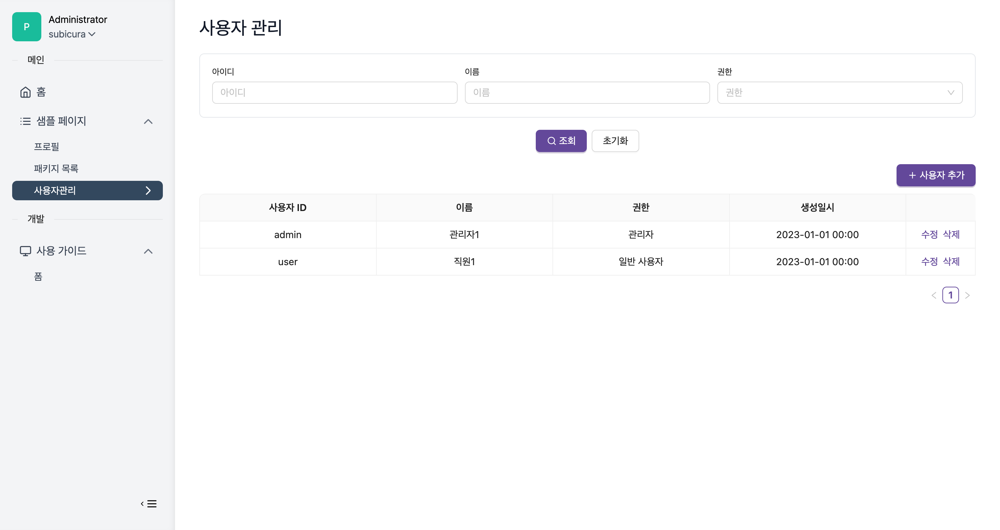

<h1 align="center">
  Purple Admin UI
</h1>

<p align="center">
  Next.js와 Tailwind를 이용한 모-던 어드민 템플릿
</p>

## 소개

누구나 손쉽고 빠르게 백오피스 페이지를 개발할 수 있도록 인기있는 라이브러리를 모아 만든 Next.js + Tailwind + Ant Design 기반 어드민 템플릿입니다. ~~어드민 개발만 10년째..~~

## 데모

https://admin-ui.purple.io/

> OAuth(Google/GitHub) 또는 아이디/패스워드(admin/admin)으로 로그인하세요.

## 프로젝트 만들기

`Deploy` 버튼을 클릭하여 소스를 복제하고 [vercel](https://vercel.com)에 배포하여 테스트 할 수 있습니다.

[](https://vercel.com/new/clone?repository-url=https%3A%2F%2Fgithub.com%2Fpurpleio%2Fpurple-admin-ui&project-name=purple-admin-ui&repository-name=purple-admin-ui&demo-title=purple-admin-ui&demo-description=Next.js%20%EA%B8%B0%EB%B0%98%20%EC%96%B4%EB%93%9C%EB%AF%BC%20UI&demo-url=https%3A%2F%2Fadmin-ui.purple.io&demo-image=https%3A%2F%2Fadmin-ui.purple.io%2Fog.png&env=NEXTAUTH_SECRET&envDescription=How%20to%20get%20these%20env%20variables%3A&envLink=https%3A%2F%2Fgithub.com%2Fpurpleio%2Fpurple-admin-ui%2Fblob%2Fmain%2F.env.example)

소스를 [다운로드](https://github.com/purpleio/purple-admin-ui/archive/refs/heads/main.zip)하거나 다음 명령어를 입력하여 프로젝트를 시작할 수 있습니다.

```bash
# npm
npx create-next-app --example "https://github.com/purpleio/purple-admin-ui"
# yarn
yarn create next-app --example "https://github.com/purpleio/purple-admin-ui"
# pnpm
pnpm create next-app --example "https://github.com/purpleio/purple-admin-ui"
```

### 기본 설정

`.env.example` 파일을 복사하여 `.env` 파일을 생성합니다.

```bash
cp .env.example .env
```

| 키                              | 설명                       | 예시                                                     |
| ------------------------------- | -------------------------- | -------------------------------------------------------- |
| NEXTAUTH_URL                    | 서비스 URL                 | http://localhost:3000                                    |
| NEXTAUTH_SECRET                 | 랜덤 비밀 키               | [랜덤생성기](https://generate-secret.vercel.app/32) 발급 |
| GITHUB_CLIENT_ID                | GitHub OAuth Client ID     |                                                          |
| GITHUB_CLIENT_SECRET            | GitHub OAuth Client Secret |                                                          |
| GOOGLE_CLIENT_ID                | Google OAuth Client ID     |                                                          |
| GOOGLE_CLIENT_SECRET            | Google OAuth Client Secret |                                                          |
| NEXT_PUBLIC_CODENBUTTER_SITE_ID | 팝업 플러그인              | [코드앤버터](https://codenbutter.com) 사이트 아이디      |

## 기술스택 & 기능

### Framework

- [Next.js](https://nextjs.org/) – Vercel에서 만든 React.js 기반 프레임워크
- [Auth.js](https://authjs.dev/) – OAuth(구글/GitHub) 또는 아이디/패스워드 로그인을 지원하는 인증 라이브러리

### Platforms

- [Vercel](https://vercel.com/) – Next.js 애플리케이션 배포 서비스

### UI

- [Tailwind CSS](https://tailwindcss.com/) – Utility-first CSS framework
- [Ant Design](https://www.radix-ui.com/) – 다양한 관리자 컴포넌트를 지원하는 UI 라이브러리
- [Lucide](https://lucide.dev/) – SVG 아이콘 모음
- [Framer Motion](https://framer.com/motion) – 애니메이션 라이브러리
- [React CountUp](https://github.com/glennreyes/react-countup) - 카운팅 애니메이션
- [`@next/font`](https://nextjs.org/docs/basic-features/font-optimization) – 웹폰트 최적화 라이브러리

### Code Quality

- [TypeScript](https://www.typescriptlang.org/) – Strongly typed programming language that builds on JavaScript
- [Prettier](https://prettier.io/) – Opinionated Code Formatter
- [ESLint](https://eslint.org/) – The pluggable linting utility for JavaScript and JSX

### Miscellaneous

- [Pretendard](https://cactus.tistory.com/306) – 어느 플랫폼에서든 사용할 수 있는 system-ui 대체 글꼴
- [Day.js](https://day.js.org/) – 날짜/시간 라이브러리
- [swr](https://swr.vercel.app/) - 데이터 조회를 위한 Hooks
- [codenbutter](https://www.codenbutter.com/) - 공지 팝업

## 디렉토리

효율적인 관리를 위해 디렉토리 구조를 다음과 같이 정의합니다.

```
┌─ src
│  ├─ client # API 호출 코드
│  ├─ components
│  │  ├─ layout # 기본 레이아웃
│  │  ├─ page # 페이지별 세부 컴포넌트
│  │  └─ shared # 공통 컴포넌트
│  ├─ fonts # 웹폰트
│  ├─ lib
│  │  ├─ auth # 인증 관련 코드
│  │  └─ hooks # react hooks
│  ├─ pages # 페이지
│  ├─ styles # 기본 스타일
│  └─ types # 타입 정의
└─ public # 이미지등 정적 파일
```

**특징**

- API 호출 코드는 `client`에 모아서 관리
- component의 style은 같은 폴더에 module.css로 작성
- `pages` 파일의 세부 컴포넌트를 `components/page`에 작성

## 커스텀 컴포넌트

- 폼 섹션 > 폼 그룹 > 필드 인라인
- 모달

## 스크린샷





## 제한

- IE 미지원

## Author

- subicura ([@subicura](https://twitter.com/subicura))
